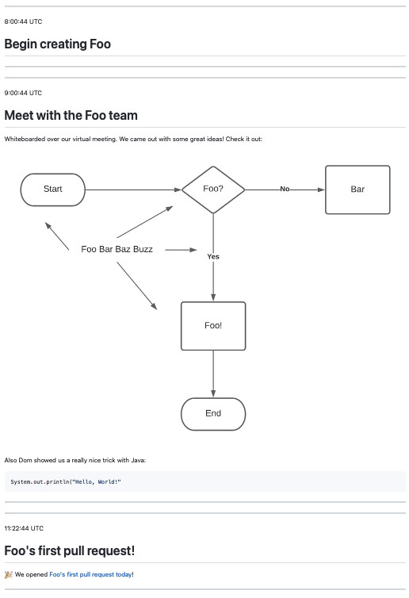

# noted

_Lightweight CLI for taking markdown notes in a journal-like (time-seried) fashion on macOS._

## Contents

- [Features](#features)
- [Getting Started](#getting-started)
    * [Required steps](#required-steps)
    * [Optional steps](#optional-steps)
- [Typical usage](#typical-usage)
- [Subcommand reference](#subcommand-reference)
- [Configuration guide](#configuration-guide)
    * [Default values](#default-values)
    * [Configuring custom values](#configuring-custom-values)
    * [Custom template file](#custom-template-file)
- [Recommended aliases](#recommended-aliases)

## Features

_Noted_ can do the following and more:

- Automatically create a markdown file for you, named with today's date (in a customizable date format)
- Append note entries from the command line automatically, formatted with a Markdown template you can customize
- Timestamp all entries with a customizable timestamp format
- Quickly open the notes from any given date for you to view or edit
- Work with any text editor, with no interference between `noted` and the editor

## Getting Started

### Required steps

Getting started with _Noted_ only requires that `noted` is placed on your path.

A good standard way to do this is to symlink the `noted` script to `/usr/local/bin` as follows.

1. Open a terminal.
2. Change to your `Documents` directory.

```shell
cd $HOME/Documents
```

3. Clone this repository to your Documents folder.

```shell
git clone git@github.com:scottashipp/noted.git -C $HOME/Documents
```

4. Symlink the file:

```shell
ln -s $HOME/Documents/noted/noted /usr/local/bin/noted
```

6. Verify that it is visible on the path:

```shell
noted version
```

If the above outputs `noted v0.0.1` then all is well. Check out the [Typical usage](#typical-usage) section below to take your first notes!

### Optional steps

You may want to follow the [configuration guide](#configuration-guide) if you do not like the defaults.

## Typical usage

You're a developer. It's 8am and you start work on a new project. From your terminal, you type:

```shell
noted 'Begin creating Foo'
```

A new Markdown file is automatically created with today's date in your configured directory.

> Note: The default directory is $HOME/Documents/noted. It will be created for you if it doesn't exist.

Second, `noted` also creates the following _automatic entry:_

```markdown
---
8:00:44 UTC

# Begin creating Foo

---
```

At 9am, you have a meeting with the Foo team. You type `noted` in your terminal to start a new note. Your default editor opens to today's file, the template is
automatically appended to the end, and it is timestamped for you. You use this entry to take notes during your meeting, which include links, images, and code.

Later, you start work again, and note this:

```shell
noted 'Working on foo again.'
```

You're trying to remember what your team talked about in last week's meeting, so you view the notes for that day:

```shell
noted view 2021-09-27
```

This opens the file from that date with your default editor.

After a bit, you open a pull request for Foo. You type:

```shell
noted
```

This automatically opens today's file in your default editor, and appends a new entry using the template. In the resulting new entry, you record the link to the
PR.

The rest of the day goes similarly. At the end of the day, you check in your notes to Git.

Your notes page, when viewed as HTML looks [just like this](example-notes-page.md):



You now have a source-controlled, time-seried journal of events. Most importantly, these notes look great and include links, snippets of code, and images.

## Subcommand reference

_Noted_ works like many other CLI's, through the use of subcommands. It currently supports config, create, edit, version, and view. These are fully-specified in
the [subcommand reference](subcommands.md)

## Configuration guide

### Default values

The following default values are configured.

| Property | Description | Default Value |
| :-- | :-- | :-- |
| NOTED_MARKDOWN_HOME | The place where markdown files are automatically generated. | `$HOME/Documents/noted` |
| NOTED_FILE_NAME_DATE_FORMAT | The date format string used as the file name for new notes. | `"+%Y-%m-%d"` | 
| NOTED_TIMESTAMP_FORMAT | The timestamp format for the timestamp placed on new entries. | `"+%H:%M:%S UTC"` |
| NOTED_TEMPLATE_FILE | A file containing a Markdown-formatted entry template to use. | `""` <br /> (It is empty by default. Which means the script's own default template will be used.) |

### Configuring custom values

To configure custom values, you may place a `.notedconfig` file in your `$HOME` directory.

For example, saving the following contents into `$HOME/.notedconfig` will alter the behavior of `noted` accordingly:

```text
# Save my notes here instead
NOTED_MARKDOWN_HOME=$HOME/Documents/mynotes
# Use month-date-year instead of year-month-date as the file names
NOTED_FILE_NAME_DATE_FORMAT="+%m-%d-%Y"
# Use Pacific time
NOTED_TIMESTAMP_FORMAT="+%H:%M:%S Pacific"
# Use my own template file
NOTED_TEMPLATE_FILE=$HOME/Documents/mynotes/template.md
```

Both the `NOTED_FILE_NAME_DATE_FORMAT` and the `NOTED_TIMESTAMP_FORMAT` are format strings as specified by the `date` shell command. You can learn more about
this format by reading the man page for `date`.

### Custom template file

_Noted_ templates only support the variables `TIMESTAMP` and `HEADERTEXT`.

`TIMESTAMP` is replaced with the output of `date` as formatted by `NOTED_TIMESTAMP_FORMAT`.

'HEADERTEXT' is the value of any argument passed to `noted` when quick-creating a note. Place it in your template so that this value is output.

By default, `noted` uses the following template:

```markdown
---
TIMESTAMP

# HEADERTEXT

---
```

Another valid custom template might be:

```markdown
# HEADERTEXT

<small>_TIMESTAMP_</small>


```

## Recommended aliases

Besides supplying a custom configuration, you probably want to add the following aliases to make using `noted` even easier:

| Alias | Description |
| :-- | :-- |
| n | Alias for `noted` itself. |
| ne | Alias for `noted edit`. |
| nv | Alias for `noted version`. |
| nc | Alias for `noted config`. |

## Usage with a static site generator

Some people may prefer to use `noted` with a static site generator like [mkdocs](https://www.mkdocs.org)
, [Maven site](https://maven.apache.org/plugins/maven-site-plugin/), or [Hugo](https://gohugo.io/). Those are just a few examples. Doing so will allow you to
view your notes in HTML format locally.