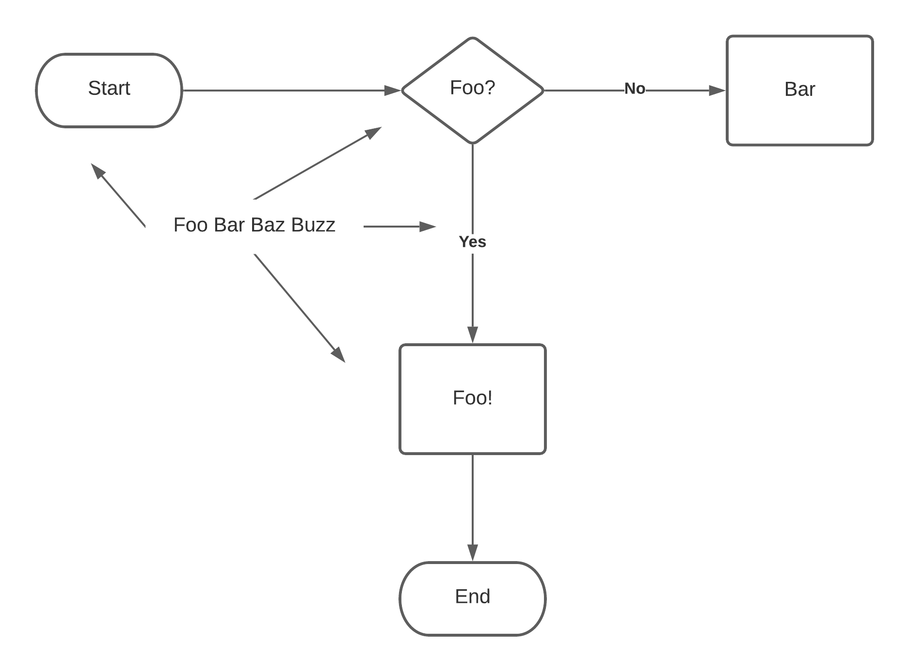

---
7:45:44 UTC

# This is the example notes page

It comes from the [Typical Usage](README.md#typical-usage) section of the README.

---

---
8:00:44 UTC

# Begin creating Foo


---

---
9:00:44 UTC

# Meet with the Foo team

Whiteboarded over our virtual meeting. We came out with some great ideas! Check it out:



Also Dom showed us a really nice trick with Java:

```java
System.out.println("Hello, World!"
```

---

---
11:22:44 UTC

# Foo's first pull request!

🎉 We opened [Foo's first pull request today](https://github.com/scottashipp/noted/pulls/1)!

---

